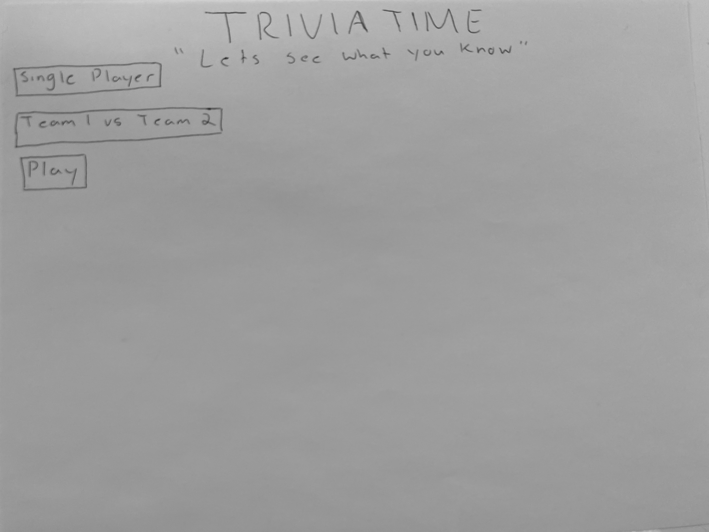
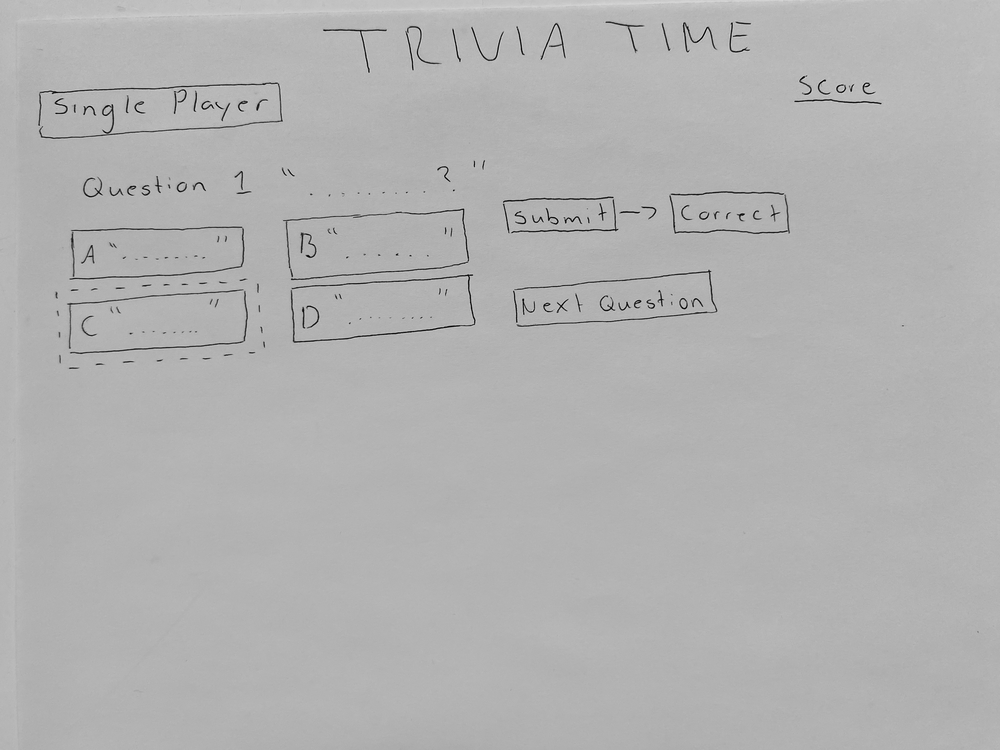
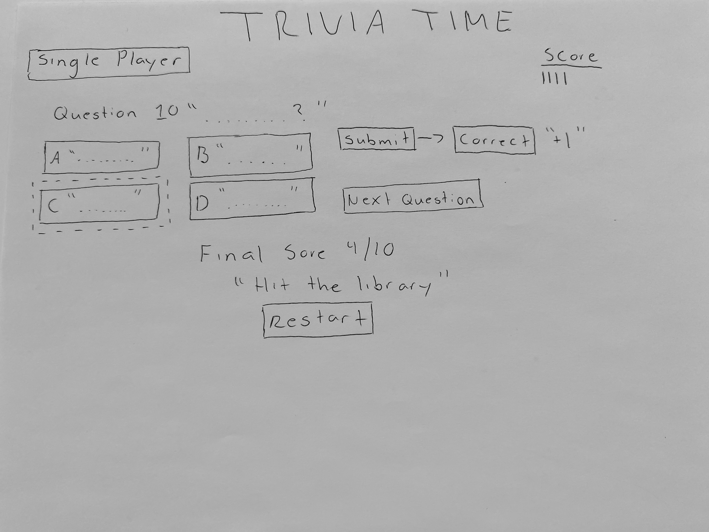
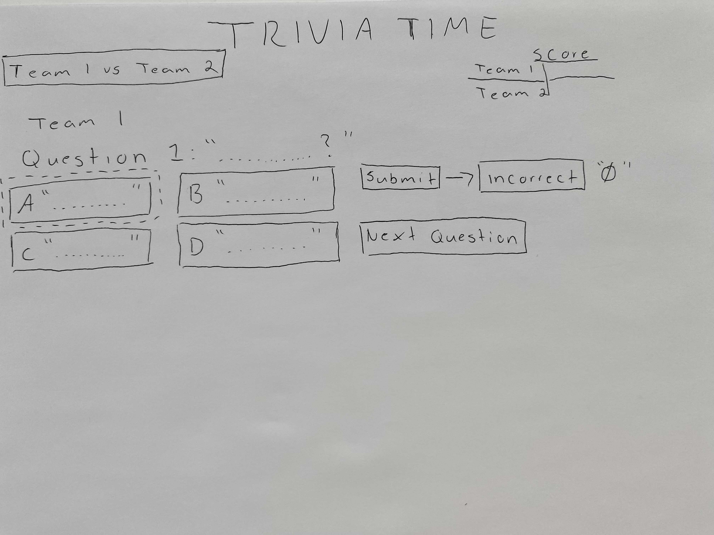
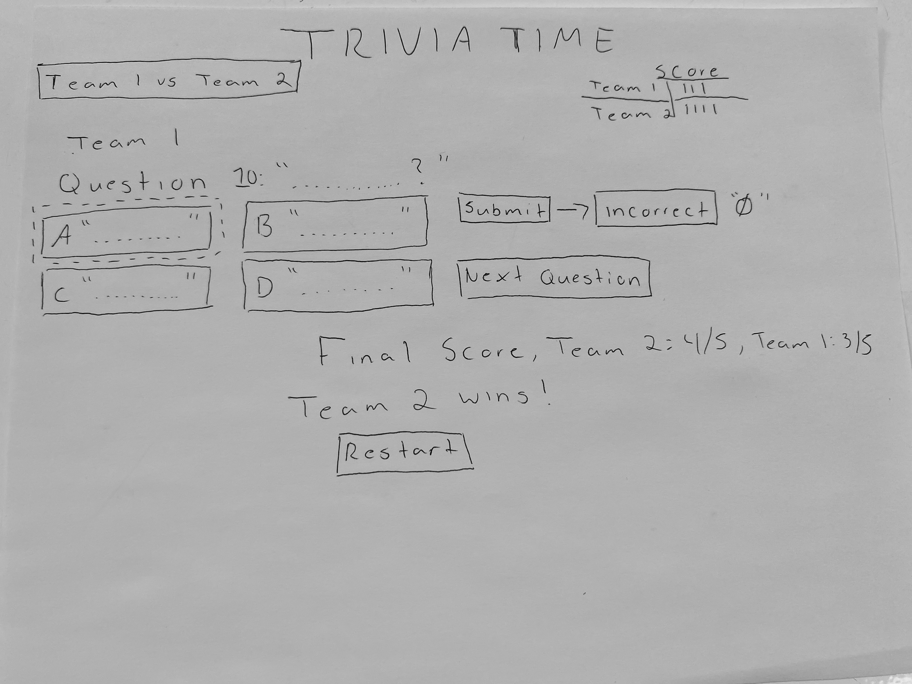

# Trivia 

### Project Description
The game of choice for the project is Trivia. The intentions of the game is to measure a player's cognitive abilities by presenting the player with fun and challenging questions based off historical events, fun facts, and trivial information. A player has the option of playing alone to guage his abilities, or play in teams alongside friends. The team with the most questions correctly answered wins, or if your'e playing alone see if you can beat your previous highscore everytime you play.

### User Stories
#### MVP Goals 
* As a user, I want to see a landing page when I arrive at the website to know I’m in the right place.
* As a user, I want to see a “play” button, on the landing page, to start the game. 
* As a user, I want to be able to click on the “next question” button, making it easy to navigate throughout the game.
* As a user, I want visual feedback after selecting, so I know my choice has been registered and whether the correct answer was selected
* As a user, I want to see the selections are being selected when I click
* As a user, I want to be presented with a clear message indicating how many questions were answered correctly 
* As a user I want to see a specific message depending on the players final score. 
* As a player I would like user friendly and engaging UI
* As a player I would like the option to restart the game.
* As a player I want the game to keep track of all the questions answered correctly.
#### Stretch Goals
* As a user, I want to see clearly labeled buttons for “multiplayer”
* As a player I would like to see a display to let me know if I got the question right.
 * As a player, I would like to see my score and a comment based on the score that I received.
 * As a user, I want to be able to click on one of the multiplayer” making it easy to navigate throughout the game.
 * As a player I would like the game to keep track of who's turn is it.
 * As a user, if playing in teams I would like to see who's turn it is to answer the question.

### Wire Frame
**Initial landing view**


**If playing single Player**


**Game final**


**If playing in Teams**
 

**Game final**


### PseudoCode
```javascript

//constants 
// Array of Objects (questions), each object will represent a question
// max points per question is one
// incorrect questions no points
// most questions asked will be 10
//player can only select one answer


//variables
//current score will change as game progresses
//index of array will change as game progresses

//Cached Elements
//Buttons for answer,
//Buttons for next question
//buttons for restart

//functions
// begining of game playerScore=0
// first question =[0]
// next question
//function that determines if the answer selected is true or false.
// once array of objects has been looped once game ends

//Event Listeners
//for when player clicks on answer next question

// when the player has the option to restart the game

```
### Data set 
- Chatgpt

### Timeline-Daily accountability
| Day       |   | Task                        | Blockers | Notes/Thoughts |
|-----------|---|-----------------------------|----------|----------------|
| Monday    |   | Create and present proposal |          |                |
| Tuesday   |   | start HTML and CSS   |          |                |
| Wedensday |   | Add functions    |          |                |
| Thursday  |   | Add functions           |          |                |
| Friday    |   | Add styling                 |          |                |
| Saturday  |   | Work on stretch goals       |          |                |
| Sunday    |   | final test run              |          |                |
| Monday    |   | Present project                     |          |                |


